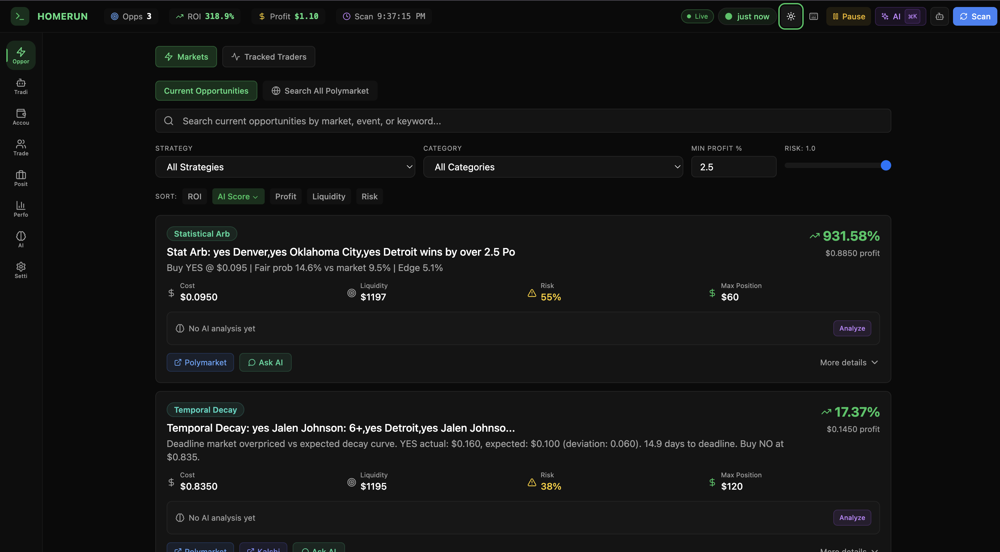

<p align="center">
  
</p>

<h1 align="center">Homerun</h1>

<p align="center">
  <strong>An autonomous trading engine that finds and executes arbitrage<br/>across prediction markets, crypto, and news — before anyone else.</strong>
</p>

<p align="center">
  <a href="https://github.com/braedonsaunders/homerun/actions/workflows/sloppy.yml"></a>
  <a href="https://github.com/braedonsaunders/homerun/blob/main/LICENSE"></a>
  <a href="https://github.com/braedonsaunders/homerun/stargazers"></a>
  <a href="https://github.com/braedonsaunders/homerun/issues"></a>
</p>

<p align="center">
  <a href="#zero-config-start">Quick Start</a>&nbsp;&nbsp;&middot;&nbsp;&nbsp;
  <a href="#18-strategies-one-scanner">Strategies</a>&nbsp;&nbsp;&middot;&nbsp;&nbsp;
  <a href="#the-full-stack">Features</a>&nbsp;&nbsp;&middot;&nbsp;&nbsp;
  <a href="#copy-trading--wallet-intelligence">Copy Trading</a>&nbsp;&nbsp;&middot;&nbsp;&nbsp;
  <a href="#api-reference">API</a>
</p>

<br/>

<p align="center">
  
</p>

<br/>

## Why This Exists

$40M+ in arbitrage has been extracted from Polymarket alone. [Published research](https://arxiv.org/abs/2503.18773) (Kroer et al.) confirmed it. Market makers optimize for speed over accuracy, which creates windows where:

- Mutually exclusive outcomes sum to **less than $1.00** (guaranteed profit)
- The same event trades at **different prices** across Polymarket and Kalshi
- Prices **lag for hours** after an outcome is effectively decided
- News breaks and markets **don't reprice for minutes**

These windows last seconds to minutes. You'd need to monitor hundreds of markets simultaneously to catch them.

Homerun watches all of them. It scores them with AI. And it can trade them autonomously.

<br/>

## Zero-Config Start

No `.env` file. No database setup. No API keys. Clone and run.

```bash
git clone https://github.com/braedonsaunders/homerun.git
cd homerun
./run.sh
```

That's it. Open **http://localhost:3000** — you're scanning live markets for arbitrage.

Everything runs on **SQLite** out of the box. The database creates itself on first launch. Paper trading works immediately with a virtual $10k account.

> **Windows?** Run `.\run.ps1` in PowerShell.

<details>
<summary><strong>Other ways to run</strong></summary>
<br/>

**TUI (terminal dashboard):**
```bash
python tui.py
```
Launches backend + frontend automatically and gives you a full terminal dashboard with real-time health monitoring, activity feed, and live logs.

**Docker:**
```bash
docker-compose up --build
```

**Make:**
```bash
make setup && make run
```

**Manual:**
```bash
# Backend
cd backend && python3 -m venv venv && source venv/bin/activate
pip install -r requirements.txt && uvicorn main:app --port 8000

# Frontend (new terminal)
cd frontend && npm install && npm run dev
```

</details>

<details>
<summary><strong>Requirements</strong></summary>
<br/>

- Python 3.10+ (3.11 recommended)
- Node.js 18+
- Docker (optional)

</details>

| Service | URL |
|---------|-----|
| Dashboard | `http://localhost:3000` |
| API | `http://localhost:8000` |
| Swagger Docs | `http://localhost:8000/docs` |
| WebSocket | `ws://localhost:8000/ws` |
| Prometheus Metrics | `http://localhost:8000/metrics` |

<br/>

## 18 Strategies, One Scanner

Most arb bots run one strategy. Homerun runs 18 simultaneously.

### Core Strategies

| # | Strategy | How It Works | Edge |
|---|----------|-------------|------|
| 1 | **Basic Arbitrage** | Buy YES + NO on same market when sum < $1.00 | $10.58M historical profit |
| 2 | **NegRisk** | Buy YES on all outcomes in mutually exclusive events | **$28.99M profit, 29x capital efficiency** |
| 3 | **Mutually Exclusive** | Two events where only one can happen — buy both | Cross-event mispricing |
| 4 | **Contradiction** | Markets saying opposite things — buy both sides | Logical inconsistency |
| 5 | **Must-Happen** | Exhaustive outcomes where one must occur | Probability sum < 100% |
| 6 | **Miracle Scanner** | Bet NO on near-impossible events (aliens, WW3 by Friday) | Garbage collection for free money |
| 7 | **Combinatorial** | Integer programming across multiple markets | Multi-leg guaranteed profit |
| 8 | **Settlement Lag** | Trade after outcome is known but prices haven't updated | Hours-long windows |

### Advanced Strategies

| # | Strategy | How It Works |
|---|----------|-------------|
| 9 | **BTC/ETH High-Frequency** | 15min/1hr binary crypto market arbitrage with Chainlink oracle tracking |
| 10 | **Cross-Platform** | Price discrepancies between Polymarket and Kalshi |
| 11 | **News Edge** | LLM reads breaking news, estimates probability, trades the gap |
| 12 | **Bayesian Cascade** | Belief propagation across correlated market graphs |
| 13 | **Liquidity Vacuum** | Order book imbalance exploitation |
| 14 | **Entropy Arbitrage** | Information-theoretic mispricing detection |
| 15 | **Event-Driven** | Price lag after news catalysts |
| 16 | **Temporal Decay** | Time-decay mispricing near deadlines |
| 17 | **Correlation Arbitrage** | Mean-reversion on correlated pair spreads |
| 18 | **Market Making** | Earn bid-ask spread as liquidity provider |

<br/>

## The Full Stack

This isn't a script. It's a platform.

### Dashboard (8 tabs)

| Tab | What It Does |
|-----|-------------|
| **Opportunities** | Live arbitrage feed with 4 views: card, table, terminal, and Polymarket search |
| **Trading** | Auto-trader controls + copy trading config |
| **Accounts** | Paper and live account management |
| **Traders** | Wallet discovery, tracking, and deep analysis |
| **Positions** | Open positions across all accounts |
| **Performance** | Equity curves, P&L charts, trade history |
| **AI** | LLM copilot, opportunity scoring, resolution analysis |
| **Settings** | 180+ configurable parameters, all persisted to database |

The Opportunities tab has sub-views for **arbitrage**, **recent trades**, **news intelligence**, and **crypto markets** — each with its own real-time data pipeline.

### Autonomous Trading

Four modes, one engine:

| Mode | What It Does |
|------|-------------|
| **Paper** | Virtual $10k account — learn risk-free, no API keys needed |
| **Shadow** | Tracks every trade without executing — full backtest |
| **Live** | Real money on Polymarket's CLOB |
| **Mock** | Full pipeline with simulated execution |

Trading infrastructure: Kelly Criterion sizing, VWAP execution, circuit breakers, emergency kill switch, daily loss limits, price chasing, maker mode for rebates, and configurable order types (GTC, FOK, GTD).

### Copy Trading & Wallet Intelligence

Don't build a strategy — copy someone who already has one.

- **Full copy trading** — mirror all trades from profitable wallets (proportional sizing)
- **Arb-only copy** — only replicate trades matching detected arbitrage patterns
- **Whale filtering** — ignore noise, only copy trades above configurable thresholds
- **Wallet discovery engine** — scans the blockchain for wallets with proven track records
- **Anomaly detection** — flags impossible win rates, front-running, wash trading, coordinated patterns
- **Real-time monitoring** — WebSocket-powered wallet activity tracking (<1s latency)

### AI Intelligence Layer

LLM-powered analysis with multi-provider support (OpenAI, Claude, Gemini, Grok, DeepSeek, Ollama, LM Studio):

- **ReAct agent loop** — reasoning + tool use for market analysis
- **LLM-as-judge scoring** — profit viability, resolution safety, execution feasibility
- **Resolution analysis** — detects ambiguity and dispute risk in market criteria
- **News Edge** — reads breaking news, estimates true probability, flags mispriced markets
- **AI Copilot** — context-aware chat panel for any opportunity, wallet, or market
- **5 built-in skills** — wallet evaluation, arbitrage assessment, miracle validation, market correlation, resolution analysis

### Crypto Markets

Dedicated crypto pipeline running independently from the main scanner:

- **2-second scan loop** on 15-minute binary markets (BTC, ETH, SOL, XRP)
- **Chainlink oracle integration** for real-time "price to beat" tracking
- **Maker mode** — limit orders to earn exchange rebates
- **Thin liquidity detection** — avoids traps below $500 depth
- Real-time WebSocket push to the dashboard

### News Intelligence

Multi-source aggregation with semantic matching:

- **Google News RSS** + **GDELT DOC 2.0 API** + custom RSS feeds
- **Semantic embeddings** (sentence-transformers with TF-IDF fallback) match articles to active markets
- **Edge detection** — LLM estimates probability from news, compares to market price, flags opportunities when edge > 8%

### ML False-Positive Classifier

A custom logistic regression model (numpy-based, zero sklearn dependency) that learns from your trading history:

- Trains on `OpportunityHistory` outcomes
- Predicts probability of profitability
- Recommendations: execute / skip / review
- Feature importance analysis
- Auto-retrains as data accumulates

### Terminal UI

Run `python tui.py` for a full terminal dashboard:

- Launches backend + frontend as managed subprocesses
- Real-time health monitoring with sparklines
- Stats grid (opportunities, wallets, trades, profit)
- Activity feed and structured log viewer with filtering
- Keyboard shortcuts for everything

### Production Infrastructure

| Feature | Details |
|---------|---------|
| **SQLite by default** | Zero-config database, auto-created on first run, auto-migrates schema |
| **Rate Limiting** | Respects Polymarket limits (Gamma: 300-4000/10s, CLOB: 500-1500/10s) |
| **Circuit Breakers** | Per-token and portfolio-level trip mechanisms |
| **Health Checks** | Kubernetes-compatible liveness + readiness probes |
| **Prometheus Metrics** | Full system observability at `/metrics` |
| **Structured Logging** | JSON logs for aggregation and analysis |
| **WebSockets** | Real-time push for opportunities, trades, wallets, news, scanner status |
| **Telegram Alerts** | Real-time notifications to your phone (optional) |
| **CSV Audit Log** | Append-only trade audit trail |
| **180+ Settings** | All configurable via UI, persisted to database |

<br/>

## Going Live

Paper trading and scanning work with zero configuration. To trade real money:

1. Get API credentials from [Polymarket Settings](https://polymarket.com/settings/api-keys)
2. Add your keys via the **Settings** tab in the dashboard, or set environment variables:

```bash
TRADING_ENABLED=true
POLYMARKET_PRIVATE_KEY=your_key
POLYMARKET_API_KEY=your_api_key
POLYMARKET_API_SECRET=your_secret
POLYMARKET_API_PASSPHRASE=your_passphrase
```

3. **Start with paper mode first.** Verify it works before risking real money.

<br/>

## API Reference

50+ endpoints. Full interactive docs at `http://localhost:8000/docs` when running.

<details>
<summary><strong>Opportunities</strong></summary>

```
GET  /api/opportunities          # Current arbitrage opportunities (with filtering)
GET  /api/opportunities/{id}     # Specific opportunity details
POST /api/scan                   # Trigger manual scan
GET  /api/strategies             # Available strategies
```

</details>

<details>
<summary><strong>Scanner Control</strong></summary>

```
GET  /api/scanner/status         # Scanner status and stats
POST /api/scanner/start          # Start scanning
POST /api/scanner/pause          # Pause scanning
POST /api/scanner/configure      # Update scanner settings
```

</details>

<details>
<summary><strong>Paper Trading</strong></summary>

```
POST /api/simulation/accounts              # Create paper account
POST /api/simulation/accounts/{id}/execute # Execute opportunity
GET  /api/simulation/accounts/{id}/performance
GET  /api/simulation/accounts/{id}/equity  # Equity curve data
```

</details>

<details>
<summary><strong>Auto Trading</strong></summary>

```
POST /api/auto-trader/start      # Start (paper/live/shadow)
POST /api/auto-trader/stop       # Stop trading
GET  /api/auto-trader/status     # Current status
POST /api/auto-trader/configure  # Update config
POST /api/auto-trader/emergency-stop  # Kill switch
```

</details>

<details>
<summary><strong>Live Trading</strong></summary>

```
POST /api/trading/orders         # Place order
GET  /api/trading/positions      # Open positions
POST /api/trading/execute-opportunity
```

</details>

<details>
<summary><strong>Copy Trading</strong></summary>

```
POST /api/copy-trading/configs              # Create config
POST /api/copy-trading/configs/{id}/enable  # Enable config
GET  /api/copy-trading/configs              # List configs
```

</details>

<details>
<summary><strong>Wallet Intelligence</strong></summary>

```
GET  /api/anomaly/analyze/{address}    # Analyze a wallet
POST /api/anomaly/find-profitable      # Find profitable wallets
GET  /api/discovery/leaderboard        # Wallet leaderboard
GET  /api/discovery/wallets/{address}  # Wallet details
```

</details>

<details>
<summary><strong>AI</strong></summary>

```
POST /api/ai/judge                     # AI opportunity scoring
POST /api/ai/analyze                   # Market analysis
GET  /api/ai/skills                    # Available AI skills
```

</details>

<details>
<summary><strong>News & Crypto</strong></summary>

```
GET  /api/news/articles          # Latest matched articles
GET  /api/news/edges             # News-driven opportunities
GET  /api/crypto/markets         # Live crypto binary markets
GET  /api/crypto/prices          # Chainlink oracle prices
```

</details>

<details>
<summary><strong>Settings</strong></summary>

```
GET  /api/settings               # Current settings
PUT  /api/settings               # Update settings (persisted to DB)
```

</details>

<details>
<summary><strong>Health & Monitoring</strong></summary>

```
GET  /health              # Basic health check
GET  /health/live         # Liveness probe
GET  /health/ready        # Readiness probe
GET  /health/detailed     # Full system diagnostics
GET  /metrics             # Prometheus metrics
WS   /ws                  # Real-time updates
```

</details>

<br/>

## Architecture

```
backend/
├── main.py                      # FastAPI entry, lifespan, health checks, metrics
├── config.py                    # 180+ settings via Pydantic Settings
├── api/                         # REST + WebSocket endpoints (11 route modules)
├── services/
│   ├── scanner.py               # Orchestrates all 18 strategies
│   ├── auto_trader.py           # Autonomous execution engine
│   ├── trading.py               # Polymarket CLOB execution
│   ├── copy_trader.py           # Copy trading orchestration
│   ├── crypto_service.py        # Dedicated crypto market pipeline
│   ├── chainlink_feed.py        # Oracle price feeds
│   ├── wallet_intelligence.py   # Pattern analysis
│   ├── anomaly_detector.py      # Statistical anomaly detection
│   ├── ml_classifier.py         # False-positive classifier
│   ├── strategies/              # 18 strategy implementations
│   ├── optimization/            # Frank-Wolfe, VWAP, constraint solver
│   ├── news/                    # Feed aggregation, semantic matching, edge detection
│   └── ai/                      # LLM agent, skills, copilot, judgment
├── models/
│   ├── database.py              # 25+ SQLAlchemy tables, auto-migration
│   └── market.py                # Market + opportunity schemas
└── utils/                       # Logging, rate limiting, retry

frontend/
├── src/
│   ├── App.tsx                  # 8-tab dashboard with sub-views
│   ├── components/              # 25+ components (shadcn/ui + custom)
│   ├── services/api.ts          # Fully typed API client
│   ├── hooks/                   # WebSocket, keyboard shortcuts, data simulation
│   └── store/                   # Jotai atoms for global state

tui.py                           # Terminal UI (Textual + Rich)
```

## Tech Stack

| Layer | Technology |
|-------|------------|
| **Backend** | Python 3.10+ · FastAPI · SQLAlchemy 2.0 (async) · Pydantic |
| **Frontend** | React 18 · TypeScript · Vite · TailwindCSS · shadcn/ui · Jotai · TanStack Query |
| **Database** | SQLite (zero-config, auto-created) |
| **Real-time** | WebSockets · React Query · Framer Motion |
| **Trading** | Polymarket CLOB · Kalshi API · Polygon RPC |
| **AI** | Multi-provider LLM (OpenAI, Claude, Gemini, Grok, DeepSeek, Ollama, LM Studio) · ReAct agent |
| **ML** | Custom logistic regression · FAISS (optional) · sentence-transformers (optional) |
| **Crypto** | Chainlink oracle feeds · Binary market scanner |
| **Notifications** | Telegram Bot API |
| **Infra** | Docker · GitHub Actions · Prometheus · Textual TUI |

<br/>

## Risk Disclosure

**This is not risk-free.** Understand before trading real money:

- **Fees** — Polymarket charges 2% on winnings. Spreads must exceed that to profit.
- **Resolution Risk** — Markets can resolve unexpectedly or ambiguously.
- **Liquidity Risk** — You may not exit at expected prices.
- **Oracle Risk** — Subjective resolution criteria can go against you.
- **Timing Risk** — Opportunities can close before your order fills.
- **Platform Risk** — Rules, fees, or market availability can change.

**Start with paper trading. Never risk money you can't afford to lose.**

<br/>

## Contributing

PRs welcome. See [**CONTRIBUTING.md**](CONTRIBUTING.md) for the full guide.

```bash
git clone https://github.com/braedonsaunders/homerun.git
cd homerun
make setup && make dev
```

<br/>

## Security

Found a vulnerability? **Do not open a public issue.** See [**SECURITY.md**](SECURITY.md) for responsible disclosure.

<br/>

## License

[MIT](LICENSE)
