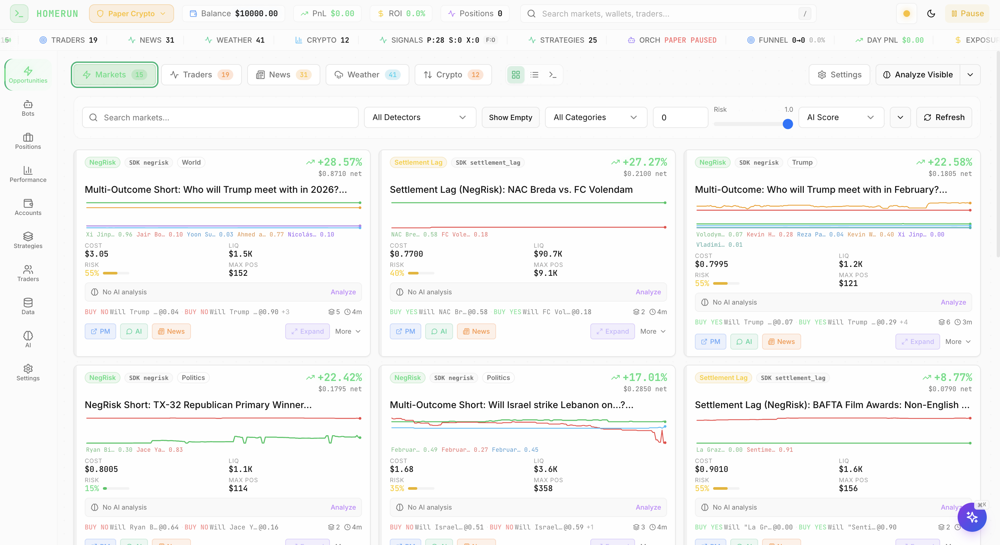
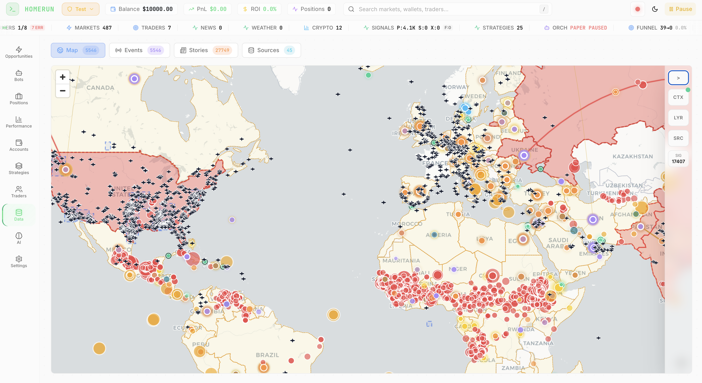
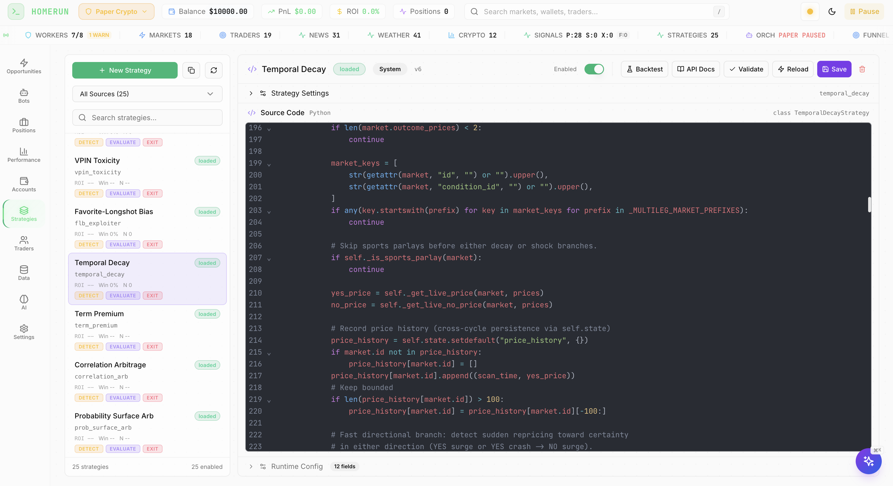

<div align="center">
  
  <p><strong>The open-source operating system for prediction market alpha.</strong></p>
  <p>Built-in strategies & data sources. Full Python. Shadow to live. One platform.</p>
</div>

<p align="center">
  
  
  
  
  
  
</p>

<p align="center">
  <a href="https://github.com/braedonsaunders/codeflow"></a>
</p>

> **If you can fetch the signal, you can trade the signal.**
>
> Homerun is a full-stack platform for building, backtesting, and executing prediction market trading systems. Write strategies and data sources in pure Python. Connect any signal — RSS, REST APIs, Twitter, Chainlink, Binance, custom scripts — into any strategy. Validate, backtest against L2 book history, run in shadow mode against a microstructure-aware fill simulator, then go live. Everything is hot-reloadable, DB-managed, and version-controlled.

<br />



## Why Homerun

Most trading bots give you a toy DSL and a rigid pipeline. Homerun gives you **full Python** and gets out of your way.

| | Others | Homerun |
|---|---|---|
| Strategy logic | Expression rules or YAML | Full async Python classes with `detect`, `evaluate`, `should_exit` |
| Data ingestion | Fixed connectors | Any Python, RSS, REST API, WebSocket — or write your own |
| Runtime editing | Redeploy the whole thing | Hot-reload via UI or API, zero downtime |
| Backtesting | Basic or none | L2 book replay, Cox-PH-modeled fill probability, walk-forward analysis, parameter sweeps |
| Execution | Single venue | Polymarket + Kalshi + microstructure-aware shadow, unified pipeline |
| AI | Bolted on | Native LLM scoring, semantic search, autonomous research agent |

## What's Inside

### Strategy Engine

Built-in strategies spanning every edge in prediction markets:

- **Cross-Platform Arbitrage** — Polymarket vs Kalshi price dislocations
- **Basic Arb** — YES + NO sums below $1.00
- **NegRisk Bundle Arb** — Mutually exclusive outcome mispricing
- **Settlement Lag** — Outcome known, price hasn't locked
- **News Edge** — LLM probability vs market mispricing
- **Crypto HF** — 5m/15m/1h/4h binary markets with sub-second execution
- **Stat Arb** — Statistical relationship mispricing
- **Weather Distribution** — Forecast probabilities vs settlement odds
- **Whale Copy Trading** — Mirror top wallets with configurable delay
- **Trader Confluence** — Aggregate signals from multiple whale wallets
- **Flash Crash Reversion** — Liquidity collapse recovery
- **VPIN Toxicity** — Market microstructure attack detection
- **CTF Basic Arb** — Split/merge structural arbitrage against live order books
- **Insider Detection** — 27-point anomaly scoring on suspicious patterns
- **Miracle Bets, Sports Overreaction Fader, Market Making** — And more

Every strategy is a DB-managed Python class. Edit in the UI, validate, backtest, enable — hot-reloaded in seconds.

### Data Source Engine



Prebuilt data source presets plus a full custom Python template:

- **RSS / Atom** — News wires, government feeds, sports, markets
- **REST APIs** — Macro events, sports scores, crypto feeds, custom endpoints
- **Twitter / X** — Real-time social signal monitoring
- **Chainlink** — On-chain price oracles
- **Binance WebSocket** — Sub-second BTC/ETH/SOL/XRP spot prices
- **Custom Python** — Full async classes with HTTP helpers, datetime parsing, and normalized output

Two ways to wire sources into strategies:
1. **Event-driven** — Subscribe to `EventType.DATA_SOURCE_UPDATE` for instant wake-up
2. **Direct read** — Call `StrategySDK.get_data_records(...)` for on-demand access

### AI & Intelligence Layer

- **LLM-Powered Judging** — Score opportunities on profit viability, resolution safety, execution feasibility
- **Semantic News Matching** — Sentence transformer embeddings + FAISS vector search to match articles to markets
- **Cortex Autonomous Agent** — Self-directed research loops with persistent memory, 10+ tools, and write capabilities
- **Multi-Agent System** — Customizable agent registry with skill plugins and chat memory
- **AI Copilot** — Context-aware assistant for market analysis and strategy tuning
- **ML Model Training** — Parameter sweeping, walk-forward evaluation, versioned model weights

### Execution & Risk Management

- **Shadow + Live Trading** — Identical API surface; one toggle promotes a strategy from `mode="shadow"` (microstructure-simulated) to `mode="live"` (real CLOB)
- **Multi-Stage Pipeline** — Detect > Evaluate > Preflight > Arm > Execute > Monitor
- **Maker-Mode Orders** — 0% fees on Polymarket CLOB limit orders
- **Multi-Leg Execution** — Parallel order submission with hedging
- **Risk Gates** — Gross exposure caps, daily loss limits, liquidity depth checks, position inventory limits
- **Kelly Criterion Sizing** — Bankroll-aware position sizing
- **Token Circuit Breaker** — Per-token flash crash prevention with automatic cooldown
- **Fill Monitoring** — Real-time order tracking, partial fill handling, timeout management

### Backtesting & Shadow Simulation

Homerun ships a microstructure-aware backtester and shadow-mode runtime that go far past the standard "depth-ahead-must-clear" heuristic everyone else uses:

- **L2 book replay** — every order book delta and trade print from Polymarket's WebSocket is persisted to `MarketMicrostructureSnapshot` (25 levels each side, 0.5 s sampling). Replay any historical period tick-for-tick.
- **Trade-vs-cancel decomposition** — depth disappearance is split into *fills* (someone took it) vs *cancels* (someone pulled it) using the trade tape. The two have very different implications for adverse selection, and most retail simulators conflate them.
- **Cox proportional hazards fill model** — `P(fill within Δt)` learned from your own historical TraderOrder fills. Covariates include queue depth ahead/behind, spread, recent trade intensity, **time-to-resolution** (the Polymarket-specific covariate that nobody else models — 60–90% of taker flow on 15-min crypto binaries hits in the last few minutes), side imbalance, underlying volatility, measured latency. Trained nightly with C-index and Brier-score validation.
- **Measured-latency injection** — order placement latency is sampled from `ExecutionLatencyMetrics` (rolling 15-min p50/p95/p99 across nine pipeline stages), not a single hardcoded constant.
- **Pessimistic / realistic / optimistic ensemble** — every shadow-mode order returns three fill estimates instead of one. The diff between them is your calibration signal.
- **Triangulation** — backtest PnL vs shadow PnL vs live PnL for the same strategy is plotted side by side. Big divergence means the fill model is the prime suspect.

The backtester surface lives under **Strategies → Research → Backtest Suite** (per-strategy detect / evaluate / exit / full-execution runs), and the fill-model surface lives under **Strategies → ML Models** (Cox model status, calibration plots, hazard-ratio table, retrain controls).

### Wallet Intelligence & Discovery

- **Whale Wallet Discovery** — On-chain Polymarket wallet scanning and profiling
- **ML-Powered Clustering** — Multi-dimensional trader grouping by behavior, liquidity, risk profile
- **Profitability Ranking** — Win rate, Sharpe ratio, signal quality scoring
- **Copy Trading** — Mirror top wallets with configurable delay and scaling
- **Network Analysis** — Trader-to-trader-to-market relationship mapping
- **Insider Detection** — 27-point anomaly scoring across timing, correlation, and volume

### Backtesting & Validation

- **Code Backtesting** — Test `detect`, `evaluate`, and `should_exit` against historical data
- **Walk-Forward Analysis** — Time-series cross-validation with configurable train/test splits
- **Parameter Optimization** — Grid search, random search, top-K ranking
- **A/B Experiments** — Create parameter variants, auto-disable underperformers with guardrails
- **Strategy Validation** — AST analysis, safety checks, and source code parsing before enable

### Real-Time Infrastructure

- **16 Background Workers** — Scanner, market universe, news, weather, events, traders, crypto, cortex, and more
- **WebSocket Feeds** — Polymarket, Kalshi, and Binance with automatic reconnect and heartbeat monitoring
- **Tiered Scanning** — HOT/WARM/COLD market prioritization with SLO-based auto-tuning
- **Price Coalescing** — 100ms window aggregation for high-frequency strategies
- **Multi-Channel WebSocket** — Real-time UI updates for opportunities, prices, trades, orders, and worker status

<br />

## Quick Start

### One-click launch

Double-click the launcher for your OS — it handles everything:

| OS | File | How |
|---|---|---|
| macOS | `scripts/launchers/Homerun.command` | Double-click in Finder |
| Windows | `scripts/launchers/Homerun.bat` | Double-click in Explorer |
| Linux | `scripts/launchers/Homerun.desktop` | Double-click in file manager |

Automatically installs Python venv, npm deps, and Postgres on first run. No manual setup.

### Shell launch

```bash
git clone <your-repo-url>
cd homerun
./scripts/infra/run.sh
```

### Local dev

```bash
make setup && make dev
```

```
Frontend:      http://localhost:3000
Backend API:   http://localhost:8000
Swagger docs:  http://localhost:8000/docs
WebSocket:     ws://localhost:8000/ws
```

### Headless / server deployment (Docker)

For running Homerun on a server, NAS, or VPS where the desktop launcher's tkinter window isn't useful. The one-click launchers above are still the recommended path for desktop use.

```bash
git clone <your-repo-url>
cd homerun
cp .env.example .env       # edit APP_SECRETS_KEY at minimum
docker compose up -d
```

Pulls pre-built images from GHCR (`ghcr.io/braedonsaunders/homerun-backend` and `-frontend`). Add `--build` to build locally instead. The stack runs Postgres, Redis, the API, three worker planes, and the frontend behind nginx — Alembic migrations are applied automatically on first start. See [docker-compose.yml](./docker-compose.yml) and [.env.example](./.env.example) for details.

### Prerequisites

- Python 3.10+ (auto-installed if missing)
- Node.js
- Docker **or** local PostgreSQL

<br />

## Write a Strategy



```python
from models import Opportunity
from services.data_events import EventType
from services.strategies.base import BaseStrategy
from services.strategy_sdk import StrategySDK


class MacroShockStrategy(BaseStrategy):
    strategy_type = "macro_shock"
    name = "Macro Shock"
    description = "Directional mispricing from external macro signals"

    source_key = "scanner"
    subscriptions = [EventType.MARKET_DATA_REFRESH]
    default_config = {"source_slug": "macro_feed_source", "min_confidence": 0.55}

    async def detect_async(self, events, markets, prices) -> list[Opportunity]:
        records = await StrategySDK.get_data_records(
            source_slug=self.config.get("source_slug", "macro_feed_source"), limit=100
        )
        if not records:
            return []

        opportunities = []
        for market in markets:
            if market.closed or not market.active or not market.clob_token_ids:
                continue
            yes_token = market.clob_token_ids[0]
            yes_price = float(prices.get(yes_token, {}).get("mid", market.yes_price) or market.yes_price)
            if yes_price >= 0.60:
                continue

            opp = self.create_opportunity(
                title=f"Macro Shock: {market.question[:80]}",
                description="Directional YES based on external macro feed signal",
                total_cost=yes_price, expected_payout=1.0, is_guaranteed=False,
                markets=[market],
                positions=[{"action": "BUY", "outcome": "YES", "price": yes_price, "token_id": yes_token}],
                confidence=float(self.config.get("min_confidence", 0.55)),
            )
            if opp:
                opportunities.append(opp)
        return opportunities
```

Validate > Backtest > Enable > Hot-reload. All from the UI or API.

<br />

## Write a Data Source

```python
from services.data_source_sdk import BaseDataSource


class MacroFeedSource(BaseDataSource):
    name = "Macro Feed"
    description = "REST ingest for macro events"
    default_config = {"endpoint": "https://example.com/macro", "limit": 200}

    async def fetch_async(self):
        payload = await self._http_get_json(self.config.get("endpoint", ""), default=[])
        rows = payload if isinstance(payload, list) else payload.get("items", [])
        return [
            {
                "external_id": str(row.get("id", "")),
                "title": str(row.get("title", "")).strip(),
                "summary": str(row.get("summary", "")).strip(),
                "category": "macro",
                "source": "macro_feed",
                "url": row.get("url"),
                "observed_at": self._parse_datetime(row.get("timestamp")),
                "payload": row,
                "tags": ["macro", "custom"],
            }
            for row in rows[: self._as_int(self.config.get("limit"), 200, 1, 5000)]
        ]
```

<br />

## Safety & Risk

This software can drive real-money trading decisions.

- Always validate and backtest strategy code before enabling execution
- Start in shadow mode and graduate carefully — and watch the triangulation panel for backtest/shadow/live PnL divergence
- Nothing in this repository is financial advice

## Contributing

Read [`docs/CONTRIBUTING.md`](./docs/CONTRIBUTING.md) &nbsp;&bull;&nbsp; Security: [`docs/SECURITY.md`](./docs/SECURITY.md)

## License

Copyright (C) 2025-2026 Braedon Saunders.

Homerun is free software: you can redistribute it and/or modify it under the terms of the GNU Affero General Public License as published by the Free Software Foundation, either version 3 of the License, or (at your option) any later version. See [`LICENSE`](./LICENSE) for the full text.

This program is distributed in the hope that it will be useful, but WITHOUT ANY WARRANTY; without even the implied warranty of MERCHANTABILITY or FITNESS FOR A PARTICULAR PURPOSE. See the GNU Affero General Public License for more details.
